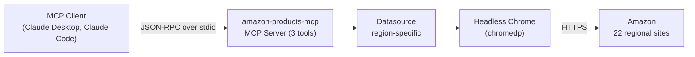
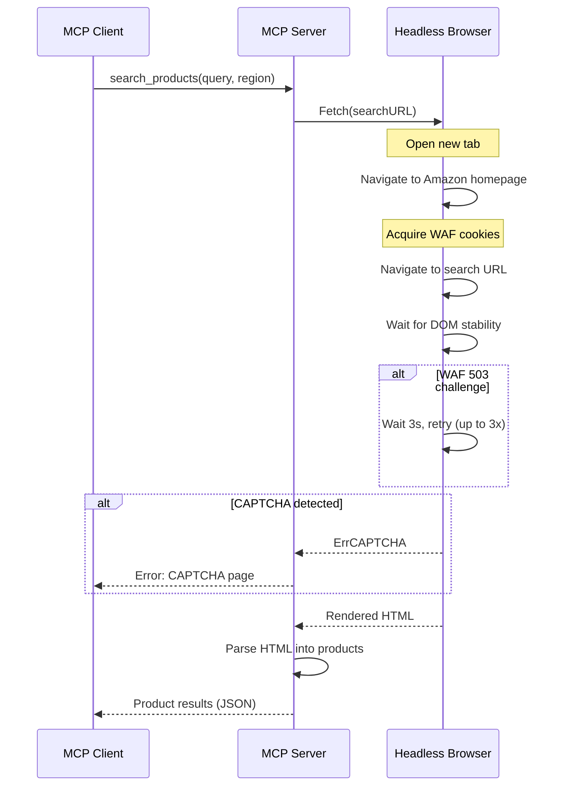

# Amazon Products MCP Server

An MCP server for searching and getting product details from Amazon. Supports 22 regional Amazon sites, extracts prices, ratings, features, availability, and product variants. Uses a headless Chrome browser to render pages and handle Amazon's anti-bot protections. Communicates over stdio and works with any MCP-compatible client such as Claude Desktop or Claude Code.

## Getting Started

### Requirements

- Google Chrome or Chromium installed (the server launches it in headless mode)

### Configuration

| Variable | Required | Description |
|---|---|---|
| `AMAZON_REGION` | No | Default Amazon region (default: `us`). Can be overridden per request. |

### Install from source

Requires Go 1.24+.

```
go install github.com/jbeshir/mcp-servers/amazon-products/cmd/amazon-products-mcp@latest
```

### Docker

The Docker image bundles a headless Chrome shell, so no local Chrome installation is needed.

```
docker build -t amazon-products-mcp ./amazon-products
docker run -e AMAZON_REGION=us amazon-products-mcp
```

### Claude Desktop

Add to your Claude Desktop configuration (`claude_desktop_config.json`):

```json
{
  "mcpServers": {
    "amazon-products": {
      "command": "/path/to/amazon-products-mcp",
      "env": { "AMAZON_REGION": "us" }
    }
  }
}
```

### Claude Code

```
claude mcp add amazon-products -- env AMAZON_REGION=us /path/to/amazon-products-mcp
```

## Tools

| Tool | Description |
|---|---|
| `list_regions` | List all supported Amazon regions with their IDs, names, and currencies |
| `search_products` | Search for products on Amazon by keyword. Returns prices, ratings, and Prime eligibility. Parameters: `query` (required), `region` (optional) |
| `get_product_details` | Get detailed product info by ASIN including price, description, features, rating, availability, and variants. Parameters: `asin` (required), `region` (optional) |

## Supported Regions

| ID | Name | Domain | Currency |
|---|---|---|---|
| `ae` | United Arab Emirates | amazon.ae | AED |
| `au` | Australia | amazon.com.au | AUD |
| `be` | Belgium | amazon.com.be | EUR |
| `br` | Brazil | amazon.com.br | BRL |
| `ca` | Canada | amazon.ca | CAD |
| `de` | Germany | amazon.de | EUR |
| `eg` | Egypt | amazon.eg | EGP |
| `es` | Spain | amazon.es | EUR |
| `fr` | France | amazon.fr | EUR |
| `ie` | Ireland | amazon.co.uk | GBP |
| `in` | India | amazon.in | INR |
| `it` | Italy | amazon.it | EUR |
| `jp` | Japan | amazon.co.jp | JPY |
| `mx` | Mexico | amazon.com.mx | MXN |
| `nl` | Netherlands | amazon.nl | EUR |
| `pl` | Poland | amazon.pl | PLN |
| `sa` | Saudi Arabia | amazon.sa | SAR |
| `se` | Sweden | amazon.se | SEK |
| `sg` | Singapore | amazon.sg | SGD |
| `tr` | Turkey | amazon.com.tr | TRY |
| `uk` | United Kingdom | amazon.co.uk | GBP |
| `us` | United States | amazon.com | USD |

## Key Concepts

- **ASIN** -- Amazon Standard Identification Number. A 10-character alphanumeric ID (e.g. `B09CDRVQZC`) that uniquely identifies a product on Amazon. Used as the primary key for `get_product_details`.
- **Regions** -- Each Amazon region maps to a specific domain (e.g. `us` maps to `amazon.com`, `de` maps to `amazon.de`). The region determines which site is scraped and which currency prices are reported in. A default region is set via `AMAZON_REGION` and can be overridden per request.
- **Variants** -- Product variations along dimensions like size, color, or style. Each variant dimension lists its options with states: `SELECTED` (currently viewed), `AVAILABLE` (can be selected), or `UNAVAILABLE` (out of stock). Each available option includes an ASIN for fetching that specific variant.
- **WAF challenges** -- Amazon's Web Application Firewall sometimes returns a 503 page with a JavaScript challenge instead of the real content. The browser handles this by navigating to the Amazon homepage first to acquire cookies, then retrying the target URL with a 3-second delay between attempts (up to 3 attempts).
- **CAPTCHA detection** -- If Amazon presents a CAPTCHA page, the server detects it and returns an error immediately rather than timing out. This is a distinct condition from WAF challenges and cannot be bypassed automatically.
- **Anti-detection** -- The headless browser overrides JavaScript properties (`navigator.webdriver`, `navigator.plugins`, `window.chrome`) and uses a realistic user agent and window size to reduce the chance of being identified as automation.

## Architecture Overview



The server has three internal layers:

- **`cmd/amazon-products-mcp`** -- Entry point. Reads `AMAZON_REGION` from the environment, creates the shared browser instance and MCP server, and starts the stdio transport.
- **`internal/server`** -- Registers 3 MCP tools, resolves the target region per request, and formats responses as JSON.
- **`internal/scraper`** -- Two components: `Datasource` builds Amazon URLs for a given region and parses returned HTML into structured data. `Browser` manages a shared headless Chrome instance, handles WAF challenges/retries, and waits for page rendering to complete.

## Data Flow



Each request runs in its own browser tab for concurrency safety. The browser waits for either a specific CSS selector (`#productTitle` for product pages) or DOM stability (body content unchanged for 2 consecutive polls at 500ms intervals) before capturing HTML.
