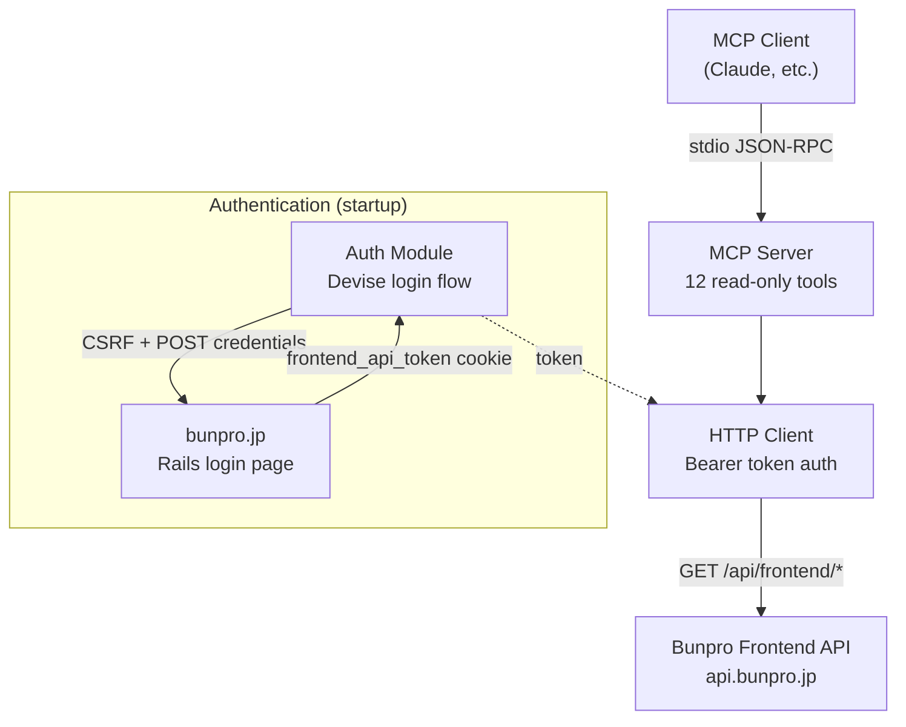
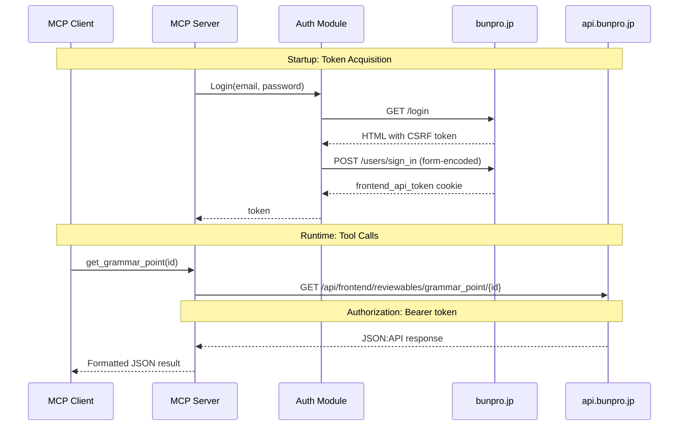

# bunpro-mcp

An MCP server that provides read-only access to [Bunpro](https://bunpro.jp), a Japanese grammar and vocabulary SRS (spaced repetition system) platform. It exposes 12 tools for querying a user's profile, study statistics, review forecasts, JLPT progress, SRS stage details, and individual grammar point or vocabulary data. Authentication is handled automatically via Bunpro's Rails Devise login flow using your email and password.

## Key Concepts

- **SRS (Spaced Repetition System)** -- Core learning mechanism. Items progress through stages: beginner, adept, seasoned, expert, master. Items answered incorrectly may become ghosts that reappear more frequently.
- **Grammar Points** -- Japanese grammar patterns (e.g. da "to be") with structure, meaning, nuance, and example sentences. Organized by JLPT level.
- **Vocabulary** -- Japanese words with readings, pitch accent patterns, frequency data, and JMDict dictionary entries.
- **JLPT Levels** -- Japanese Language Proficiency Test levels N5 (easiest) through N1 (hardest). Bunpro organizes all content by JLPT level.
- **Decks** -- Study collections with configurable batch sizes and daily lesson goals.
- **Review Forecast** -- Predicted number of upcoming reviews, viewable by day or by hour.

## Architecture

The server has four layers: an entry point that reads configuration and obtains a token, an auth module that performs the Devise login flow when needed, an HTTP client that calls the Bunpro frontend API with Bearer token auth, and the MCP server that registers tools and formats responses.



Authentication happens once at startup. The auth module fetches a CSRF token from the login page, submits form-encoded credentials, and extracts the `frontend_api_token` cookie. The token has approximately a 2-day lifetime — long enough for any single MCP session.

## Data Flow

The sequence diagram below shows both the startup token acquisition and a runtime tool call. All API requests are GET requests to `api.bunpro.jp/api/frontend/*` with the token sent as a Bearer authorization header.



## Getting Started

### Requirements

- **Go 1.24+** (to build from source)
- A **Bunpro account** (free or paid)

### Installation

Pre-built binaries are available from [Releases](https://github.com/jbeshir/mcp-servers/releases).

Install from source:

```
go install github.com/jbeshir/mcp-servers/bunpro/cmd/bunpro-mcp@latest
```

Or build from the repo root:

```
make build
```

### Configuration

| Variable | Required | Description |
|---|---|---|
| `BUNPRO_EMAIL` | Yes | Bunpro account email |
| `BUNPRO_PASSWORD` | Yes | Bunpro account password |
| `BUNPRO_API_URL` | No | API base URL (default: `https://api.bunpro.jp`) |
| `BUNPRO_LOGIN_URL` | No | Login page URL (default: `https://bunpro.jp`) |

#### Claude Desktop

```json
{
  "mcpServers": {
    "bunpro": {
      "command": "/path/to/bunpro-mcp",
      "env": {
        "BUNPRO_EMAIL": "you@example.com",
        "BUNPRO_PASSWORD": "your-password"
      }
    }
  }
}
```

#### Claude Code

```
claude mcp add bunpro /path/to/bunpro-mcp -e BUNPRO_EMAIL=you@example.com -e BUNPRO_PASSWORD=your-password
```

## Tools

All tools are read-only. No tool modifies Bunpro data.

| Tool | Parameters | Description |
|---|---|---|
| `get_user` | -- | User profile: level, XP, streak, subscription status |
| `get_study_queue` | -- | Due grammar and vocabulary review counts |
| `get_decks` | -- | Deck settings: daily goals, progress, batch sizes |
| `get_stats` | -- | Study statistics: days studied, streak, accuracy, badges |
| `get_jlpt_progress` | -- | JLPT N5-N1 progress with SRS stage counts |
| `get_review_forecast` | `granularity` (optional): `"daily"` or `"hourly"` | Upcoming review forecast split by grammar and vocabulary |
| `get_srs_overview` | -- | Aggregate SRS level counts (beginner through master, plus ghost and self-study) |
| `get_review_activity` | -- | Daily review counts for the past ~30 days |
| `get_grammar_srs_details` | `level` (required): `beginner`, `adept`, `seasoned`, `expert`, or `master`; `page` (optional) | Paginated grammar review items at a specific SRS level |
| `get_vocab_srs_details` | `level` (required): `beginner`, `adept`, `seasoned`, `expert`, or `master`; `page` (optional) | Paginated vocabulary review items at a specific SRS level |
| `get_grammar_point` | `id` (required) | Grammar point details: meaning, structure, nuance, study questions |
| `get_vocab` | `slug_or_id` (required): slug (e.g. "食べる") or numeric ID | Vocabulary details: readings, pitch accent, frequency, JMDict entries |
