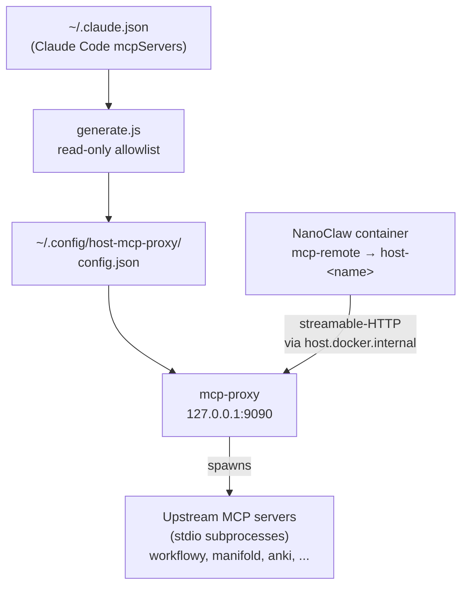

# host-proxy

A read-only MCP aggregator that exposes the host's Claude Code MCP servers to NanoClaw agent containers over streamable HTTP. It runs as a systemd user service, fronts every MCP server listed in `~/.claude.json`, and filters each upstream's tool list down to a hand-curated read-only allowlist so containerised agents can read host data without being able to mutate it.

## Key concepts

- **Upstream MCP server** — A stdio MCP server already configured in `~/.claude.json` (e.g. `workflowy`, `manifold`, `anki`). The proxy spawns each one as a subprocess.
- **Read-only allowlist** — A static `name → [tool, ...]` map in `generate.js`. Tools not on the list are dropped before they reach any client. Edit this map to expose or hide tools.
- **Aggregator config** — `~/.config/host-mcp-proxy/config.json`, regenerated by `generate.js`. It joins each upstream's `command`/`args`/`env` (copied from `~/.claude.json`) with its allowlist, in the format consumed by [`tbxark/mcp-proxy`](https://github.com/TBXark/mcp-proxy). Lives outside the repo because it contains live credentials.
- **Endpoint layout** — Each upstream is exposed at `http://127.0.0.1:9090/<name>/mcp` (streamable HTTP). Containers reach the host via `host.docker.internal`.

## Architecture



`generate.js` reads the upstream definitions from `~/.claude.json` and merges in the per-server allowlist to produce `config.json`. The systemd unit launches `tbxark/mcp-proxy` against that config; the proxy spawns each upstream as a stdio subprocess and exposes the filtered union over HTTP. NanoClaw injects one `host-<name>` MCP entry per upstream into each container's `container.json`; in-container, `mcp-remote` bridges stdio↔HTTP so the agent SDK sees them as ordinary MCP servers.

## Dependencies

- [`tbxark/mcp-proxy`](https://github.com/TBXark/mcp-proxy) — the aggregator binary, expected at `~/bin/mcp-proxy`. Install with `GOBIN=~/bin go install github.com/TBXark/mcp-proxy@latest`.
- `~/.claude.json` — Claude Code config; the source of upstream `command`/`args`/`env`.
- The upstream MCP server binaries themselves (e.g. `~/bin/workflowy-mcp`); the proxy execs them per the config.
- `node` on `PATH` — used to run `generate.js`.

## Layout

| File | Purpose |
|------|---------|
| `generate.js` | Reads `~/.claude.json` + the in-file allowlist, writes `~/.config/host-mcp-proxy/config.json`. Symlinked to `~/.config/host-mcp-proxy/generate.js`. |
| `host-mcp-proxy.service` | systemd user unit. Symlinked to `~/.config/systemd/user/host-mcp-proxy.service`. |

The generated `config.json` is **not** in the repo: it contains live credentials and is regenerated when the allowlist or upstreams change.

## Getting started

```bash
# 1. Install the proxy binary
GOBIN=~/bin go install github.com/TBXark/mcp-proxy@latest

# 2. Symlink the generator and unit into place
mkdir -p ~/.config/host-mcp-proxy ~/.config/systemd/user
ln -s "$PWD/generate.js" ~/.config/host-mcp-proxy/generate.js
ln -s "$PWD/host-mcp-proxy.service" ~/.config/systemd/user/host-mcp-proxy.service

# 3. Generate the live config from ~/.claude.json + the allowlist
node ~/.config/host-mcp-proxy/generate.js

# 4. Enable and start
systemctl --user daemon-reload
systemctl --user enable --now host-mcp-proxy.service

# 5. Verify
systemctl --user status host-mcp-proxy.service
journalctl --user -u host-mcp-proxy -n 50 | grep -E 'Adding tool|Connected'
```

To change which tools are exposed, edit the `ALLOWLIST` table in `generate.js`, re-run the generator, then `systemctl --user restart host-mcp-proxy`.
