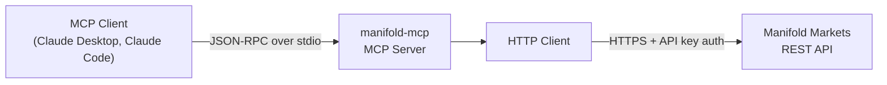
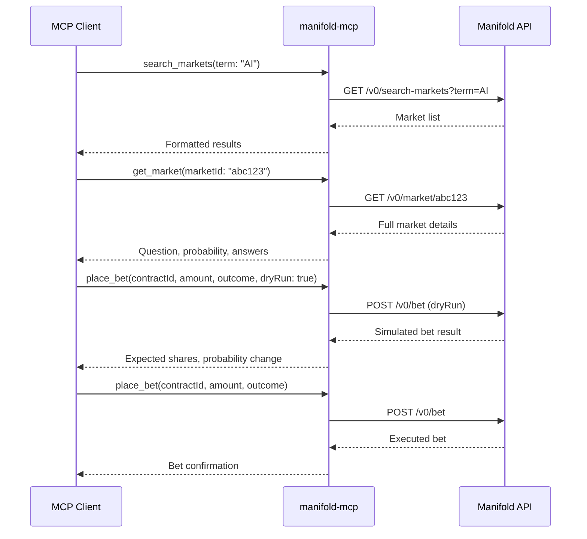

# Manifold Markets MCP Server

An MCP server for interacting with [Manifold Markets](https://manifold.markets), a prediction market platform. Provides 18 tools covering market discovery, trading (bets and limit orders), market management (creation, resolution, comments, liquidity), and portfolio analytics. Communicates over stdio and works with any MCP-compatible client such as Claude Desktop or Claude Code.

## Getting Started

### Requirements

- A Manifold Markets API key from your [account settings](https://manifold.markets/profile)

### Configuration

| Variable | Required | Description |
|---|---|---|
| `MANIFOLD_API_KEY` | Yes | Your Manifold Markets API key |
| `MANIFOLD_API_URL` | No | Custom API URL (default: `https://api.manifold.markets`) |

### Install from source

Requires Go 1.24+.

```
go install github.com/jbeshir/mcp-servers/manifold/cmd/manifold-mcp@latest
```

### Pre-built binaries

Download from [Releases](https://github.com/jbeshir/mcp-servers/releases).

### Docker

```
docker build -t manifold-mcp ./manifold
docker run -e MANIFOLD_API_KEY=<your-key> manifold-mcp
```

### Claude Desktop

```json
{
  "mcpServers": {
    "manifold": {
      "command": "/path/to/manifold-mcp",
      "env": { "MANIFOLD_API_KEY": "<your-key>" }
    }
  }
}
```

### Claude Code

```
claude mcp add manifold -- env MANIFOLD_API_KEY=<your-key> /path/to/manifold-mcp
```

## Tools

### Read operations

| Tool | Description |
|---|---|
| `search_markets` | Search markets by keyword and filters |
| `get_market` | Get full market details including answers and description |
| `get_user` | Get a user's profile by username |
| `get_me` | Get the authenticated user's profile |
| `list_bets` | List bets with optional filters |
| `get_comments` | Get comments on markets |
| `get_positions` | Get user positions for a specific market |

### Trading

| Tool | Description |
|---|---|
| `place_bet` | Place a bet or limit order (supports `dryRun`) |
| `sell_shares` | Sell shares in a market |
| `cancel_bet` | Cancel a pending limit order |

### Market management

| Tool | Description |
|---|---|
| `create_market` | Create a new market (binary, multiple choice, or numeric) |
| `resolve_market` | Resolve a market you created |
| `close_market` | Close a market or change its closing time |
| `add_comment` | Comment on a market |
| `add_liquidity` | Add mana liquidity to a market |
| `send_mana` | Send mana to other users |

### Analytics

| Tool | Description |
|---|---|
| `get_baseline` | Get deterministic baseline probability for a market at a past time (default: 24h) |
| `get_portfolio_pnl` | Get full portfolio P&L summary with 24h changes for all positions |

## Key Concepts

- **Markets** -- Questions that users trade on. Each market has a type (binary yes/no, multiple choice, pseudo-numeric, etc.), a probability or set of answer probabilities, and a closing time after which no new bets are accepted.
- **Mana** -- The platform currency used for betting and trading. Users receive mana through deposits, trading profits, and transfers from other users. Mana is also used to add liquidity to markets or to send to other users.
- **Bets and shares** -- Placing a bet on an outcome buys shares in that outcome. The price per share reflects the market's current probability. Shares can be sold back at any time before resolution.
- **Limit orders** -- Instead of buying at the current price, a limit order specifies a probability threshold. The order stays open until it fills, expires, or is cancelled. Use `place_bet` with a `limitProb` parameter to create one.
- **Positions** -- A user's current holdings in a market: which outcomes they hold shares in, how many, and their profit/loss.
- **Resolution** -- The market creator decides the outcome (YES, NO, MKT for partial, or CANCEL). For multiple choice markets, a specific answer ID is resolved. Resolution triggers payouts to shareholders.
- **Liquidity** -- Mana added to a market's pool to reduce slippage (the price impact of large bets). Higher liquidity means prices move less per bet.
- **Market types** -- BINARY (yes/no), MULTIPLE_CHOICE (several named answers), FREE_RESPONSE (open-ended answers), PSEUDO_NUMERIC (numeric range mapped to a probability), BOUNTY, POLL, and NUMBER.
- **Dry runs** -- The `place_bet` tool supports `dryRun=true` to simulate a bet without executing it, showing what the outcome and cost would be.

## Architecture Overview



The server has three internal layers:

- **`cmd/manifold-mcp`** -- Entry point. Reads configuration from environment variables, creates the HTTP client and MCP server, and starts the stdio transport.
- **`internal/server`** -- Registers all 18 MCP tools, routes incoming requests to handlers, and formats responses. Tool definitions are split across `tools.go` (read operations), `tools_trading.go` (trading), and `tools_manage.go` (market management).
- **`internal/client`** -- REST client for the Manifold Markets API. Handles authentication (API key in the `Authorization` header), JSON serialization, and error handling.

## Data Flow

A typical trading workflow: search for a market, inspect it, simulate a bet, then execute.


