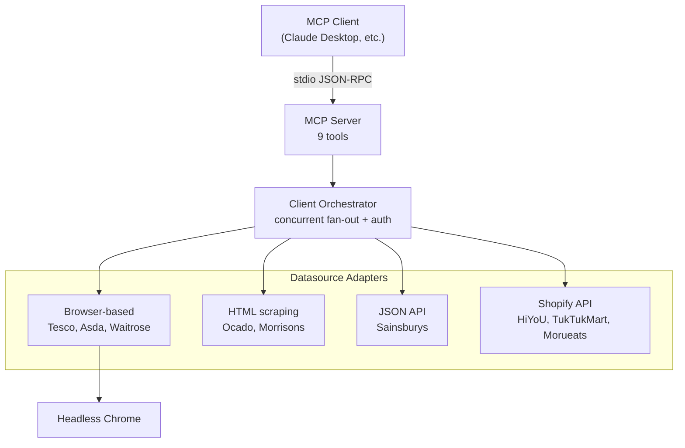
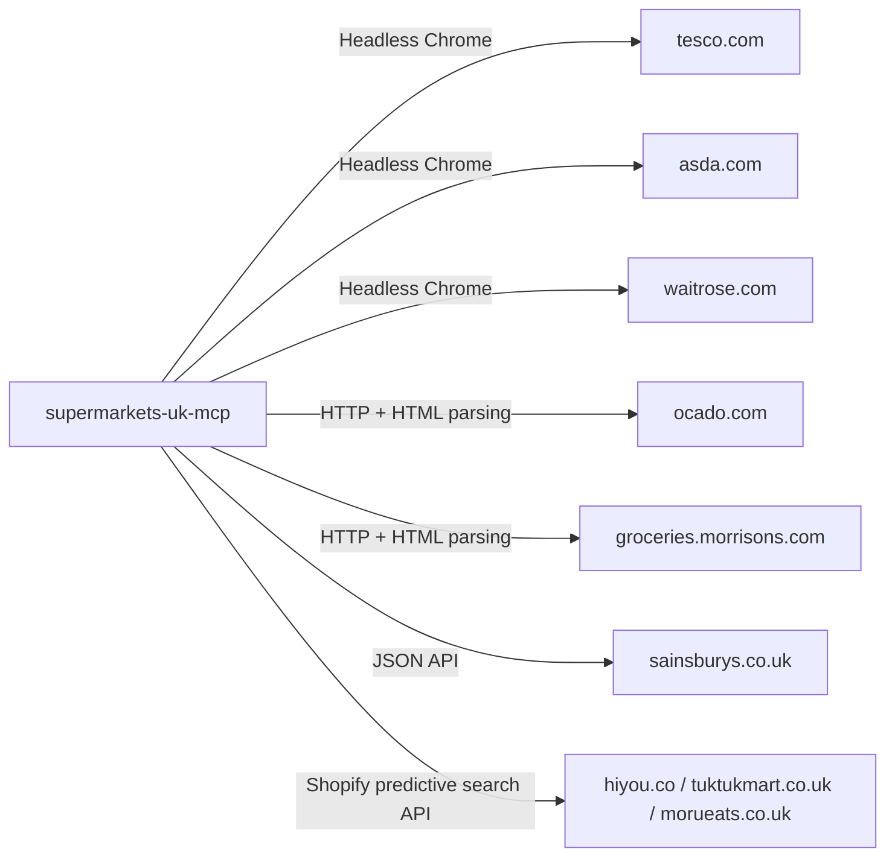
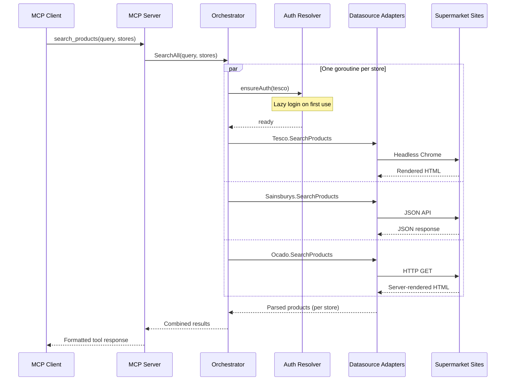

# supermarkets-uk-mcp

An MCP server for searching and comparing grocery prices across 9 UK supermarkets. It provides product search, price comparison, category browsing, and (for Tesco) order history and basket management. Each supermarket is implemented as a pluggable datasource behind a common interface, with the server fanning out concurrent requests across stores and aggregating the results.

## Getting Started

### Requirements

- **Go 1.24+** (to build from source)
- **Chrome, Chromium, or Microsoft Edge** — required for Tesco, Asda, and Waitrose (headless browser rendering), and for login to any supermarket. Sainsbury's, Ocado, Morrisons, and the Shopify stores work without a browser.

### Installation

Pre-built binaries are available from [Releases](https://github.com/jbeshir/mcp-servers/releases).

Install from source:

```
go install github.com/jbeshir/mcp-servers/supermarkets-uk/cmd/supermarkets-uk-mcp@latest
```

Or build from the repo root:

```
make build
```

A Dockerfile is also provided, based on `chromedp/headless-shell` so that browser-based stores work out of the box:

```
docker build -t supermarkets-uk-mcp ./supermarkets-uk
```

### Configuration

No environment variables are required to get started — all supermarkets work without login.

#### Claude Desktop

```json
{
  "mcpServers": {
    "supermarkets-uk": {
      "command": "/path/to/supermarkets-uk-mcp"
    }
  }
}
```

#### Claude Code

```
claude mcp add supermarkets-uk /path/to/supermarkets-uk-mcp
```

## Tools

| Tool | Description |
|---|---|
| `list_supermarkets` | List all supported supermarkets with IDs and status |
| `search_products` | Search for products across one or more supermarkets |
| `compare_prices` | Compare prices for a product across all supermarkets |
| `get_product_details` | Get detailed product info (price, description, ingredients, nutrition) |
| `browse_categories` | Browse product categories for a supermarket |
| `get_order_history` | Get past order history (Tesco only, requires login) |
| `get_basket` | Get current shopping basket contents (Tesco only, requires login) |
| `add_to_basket` | Add a product to the basket or update its quantity (Tesco only, requires login) |
| `remove_from_basket` | Remove a product from the basket (Tesco only, requires login) |

## Supported Supermarkets

| Supermarket | ID | Data Source | Browser Required |
|---|---|---|---|
| Tesco | `tesco` | HTML (headless browser) | Yes |
| Sainsbury's | `sainsburys` | JSON API | No |
| Ocado | `ocado` | Server-rendered HTML (OSP) | No |
| Morrisons | `morrisons` | Server-rendered HTML (OSP) | No |
| Asda | `asda` | Algolia API (search) + HTML (details) | Yes |
| Waitrose | `waitrose` | HTML (headless browser) | Yes |
| HiYoU | `hiyou` | Shopify predictive search API | No |
| Tuk Tuk Mart | `tuktukmart` | Shopify predictive search API | No |
| Morueats | `morueats` | Shopify predictive search API | No |

## Product Information Coverage

Not all supermarkets provide the same level of detail:

| Field | Tesco | Sainsbury's | Ocado | Morrisons | Asda | Waitrose | Shopify stores |
|---|---|---|---|---|---|---|---|
| Name / Price / URL | Yes | Yes | Yes | Yes | Yes | Yes | Yes |
| Price per unit | Yes | Yes | Yes | Yes | Yes | Yes | -- |
| Promotions | Yes | Yes | Yes | Yes | Yes | Yes | -- |
| Description | Yes | Yes | Yes | Yes | Yes | Yes | Yes |
| Ingredients | Yes | Yes | Yes | Yes | Yes | Yes | -- |
| Nutrition | Yes | Yes | Yes | Yes | Yes | Yes | -- |
| Dietary info | -- | -- | -- | -- | Yes | -- | -- |
| Weight | -- | -- | -- | Yes | Yes | Yes | Yes |

## Login

Login is optional and enables personalised results (e.g. local stock, delivery availability), order history, and basket management. It requires running the server locally with a browser available.

To enable login, set `<SUPERMARKET>_LOGIN=true` for each supermarket you want to log in to. On first use, a visible browser window opens for you to complete login manually. Session cookies are cached to disk and reused across restarts. If cookies expire, the server clears them and triggers a fresh login automatically.

Login requires Chrome, Chromium, or Edge for all supermarkets, including those that do not otherwise need a browser. Supermarket sessions tend to expire frequently, so expect to be prompted to log in again regularly.

| Variable | Description |
|---|---|
| `TESCO_LOGIN` | Enable Tesco login |
| `SAINSBURYS_LOGIN` | Enable Sainsbury's login |
| `OCADO_LOGIN` | Enable Ocado login |
| `MORRISONS_LOGIN` | Enable Morrisons login |
| `ASDA_LOGIN` | Enable Asda login |
| `WAITROSE_LOGIN` | Enable Waitrose login |
| `SUPERMARKET_COOKIE_DIR` | Override cookie storage directory (default: OS config dir) |

Example with login enabled:

```json
{
  "mcpServers": {
    "supermarkets-uk": {
      "command": "/path/to/supermarkets-uk-mcp",
      "env": {
        "TESCO_LOGIN": "true",
        "WAITROSE_LOGIN": "true",
        "SUPERMARKET_COOKIE_DIR": "/home/you/.supermarket-cookies"
      }
    }
  }
}
```

## Key Concepts

- **Datasource** — A pluggable adapter for a single supermarket. Each datasource implements a common `ProductSource` interface (search, product details, category browsing) using whatever transport the supermarket requires: JSON API, server-rendered HTML scraping, or headless Chrome rendering.
- **AuthProductSource** — An extension of `ProductSource` that supports session cookie injection and validation. Six of the nine supermarkets implement this interface, allowing logged-in features like personalised results. The three Shopify-based stores are plain `ProductSource` implementations with no auth support.
- **Client orchestrator** — The `client.Client` type wires together all nine datasources. It manages concurrent fan-out for searches, lazy authentication with session expiry detection, and per-host rate limiting.
- **Auth resolver** — A per-supermarket wrapper that handles lazy login. On first use of a login-enabled supermarket, it opens a visible browser window for the user to complete login manually. Session cookies are persisted to disk and reused. If a request returns `ErrSessionExpired`, the resolver clears the cookies and triggers a fresh login.
- **Shared browser** — A single headless Chrome instance (via chromedp) shared across all browser-based datasources. Each request opens a new tab within the shared browser context so that cookies persist between navigations.
- **OSP (Ocado Smart Platform)** — Ocado and Morrisons share a common server-rendered HTML structure. A single `osp` package implements both, parameterised by store-specific config.

## Architecture



## External Dependencies



## Data Flow

A `search_products` call with multiple supermarkets triggers concurrent requests across all targeted stores. Individual store failures are captured per-result rather than failing the entire request.



When a logged-in request fails with `ErrSessionExpired`, the auth resolver clears the cached cookies, opens a browser window for re-login, and retries the request transparently.
