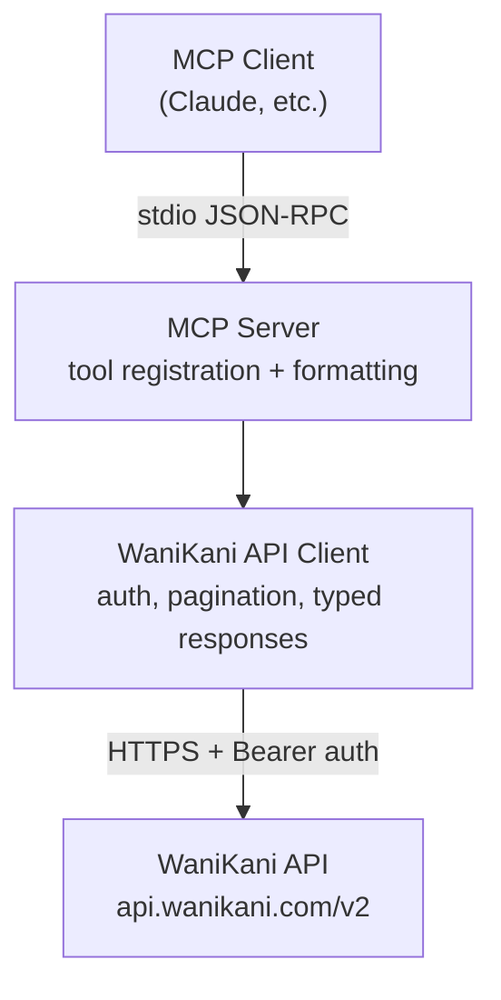
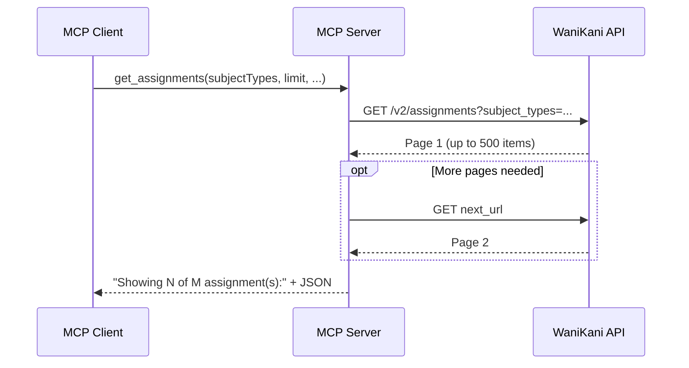

# wanikani-mcp

An MCP server that provides read-only access to a user's [WaniKani](https://www.wanikani.com/) data. WaniKani is a spaced repetition system (SRS) for learning Japanese kanji and vocabulary. This server exposes six tools that let Claude and other MCP clients query a user's profile, lesson/review schedule, SRS assignments, subject details, review statistics, and level progression history.

## Key Concepts

- **SRS (Spaced Repetition System)** -- WaniKani's core learning mechanism. Items progress through stages 0 (initiate) to 9 (burned) based on correct and incorrect reviews. Higher stages mean longer intervals between reviews.
- **Subjects** -- The items a user learns. There are four types: **radicals** (building blocks), **kanji** (characters), **vocabulary** (multi-kanji words), and **kana vocabulary** (kana-only words). Each subject has meanings, readings, and mnemonics.
- **Assignments** -- Track a user's SRS progress on each subject: current stage, when it was unlocked, started, passed, and burned.
- **Lessons** -- The introduction of new subjects. A subject becomes available as a lesson when its prerequisites are met.
- **Reviews** -- Periodic quizzes that test recall. Correct answers advance the SRS stage; incorrect answers regress it.
- **Levels** -- A user's overall progress through WaniKani (1--60). Advancing to a new level unlocks new subjects.

## Architecture

The server has three layers: an entry point that reads configuration and wires dependencies, an MCP server layer that registers tools and converts parameters, and an HTTP client that communicates with the WaniKani API.



The server uses `mcp-go` for MCP protocol handling and stdio transport. The WaniKani API client uses Go generics (`Resource[T]` and `Collection[T]`) to provide typed access to all endpoints with automatic pagination.

## Data Flow



Collection endpoints are automatically paginated. Results are capped at a configurable limit (default 500, max 10,000) and include a "Showing N of M" header so the client knows whether results were truncated.

## Getting Started

### Requirements

- **Go 1.24+** (to build from source)
- **WaniKani API token** from [wanikani.com/settings/personal_access_tokens](https://www.wanikani.com/settings/personal_access_tokens)

### Installation

Pre-built binaries are available from [Releases](https://github.com/jbeshir/mcp-servers/releases).

Install from source:

```
go install github.com/jbeshir/mcp-servers/wanikani/cmd/wanikani-mcp@latest
```

Or build from the repo root:

```
make build
```

### Configuration

| Variable | Required | Default | Description |
|---|---|---|---|
| `WANIKANI_API_KEY` | Yes | -- | Bearer token from wanikani.com/settings/personal_access_tokens |
| `WANIKANI_API_URL` | No | `https://api.wanikani.com` | Base URL override for the WaniKani API |

#### Claude Desktop

```json
{
  "mcpServers": {
    "wanikani": {
      "command": "/path/to/wanikani-mcp",
      "env": {
        "WANIKANI_API_KEY": "your-api-token"
      }
    }
  }
}
```

#### Claude Code

```
claude mcp add wanikani -e WANIKANI_API_KEY=your-api-token /path/to/wanikani-mcp
```

## Tools

| Tool | Description | Parameters |
|---|---|---|
| `get_user` | Get the authenticated user's profile, including level, subscription, and vacation status | -- |
| `get_summary` | Get available lessons and reviews grouped by hour | -- |
| `get_assignments` | Get SRS assignments tracking progress on subjects through SRS stages | `subjectTypes`, `levels`, `srsStages`, `availableBefore`, `availableAfter`, `immediatelyAvailableForReview`, `immediatelyAvailableForLessons`, `limit` |
| `get_subjects` | Get radicals, kanji, and vocabulary with meanings, readings, and mnemonics | `types`, `levels`, `slugs`, `ids`, `limit` |
| `get_review_statistics` | Get review accuracy statistics per subject, including correct/incorrect counts and streaks | `subjectTypes`, `subjectIds`, `percentagesGreaterThan`, `percentagesLessThan`, `limit` |
| `get_level_progressions` | Get the user's progression history through WaniKani levels with timestamps | `limit` |

All tools are read-only. Collection tools accept a `limit` parameter (default: 500, max: 10,000). Filter parameters that accept multiple values use comma-separated strings (e.g. `"radical,kanji"`).
