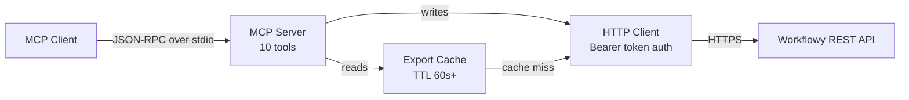
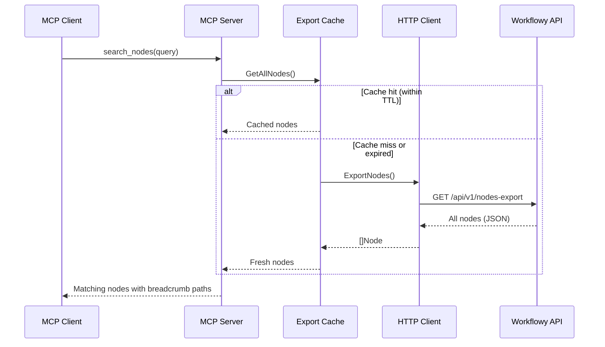
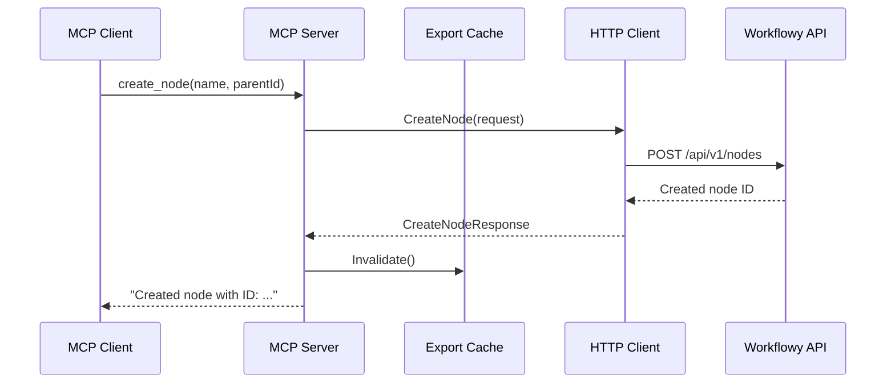

# workflowy-mcp

An [MCP](https://modelcontextprotocol.io/) server that provides full read/write access to [Workflowy](https://workflowy.com). Search, create, organize, move, and complete nodes from any MCP-compatible client such as Claude Desktop or Claude Code. The server communicates over stdio and caches Workflowy's export endpoint to stay within API rate limits.

## Getting Started

### Requirements

- A Workflowy API token from [workflowy.com/api-key](https://workflowy.com/api-key)

### Configuration

| Variable | Required | Description |
|---|---|---|
| `WORKFLOWY_API_TOKEN` | Yes | Your Workflowy API token |
| `WORKFLOWY_API_URL` | No | Custom API URL (default: `https://workflowy.com`) |

### Install from source

Requires Go 1.24+.

```
go install github.com/jbeshir/mcp-servers/workflowy/cmd/workflowy-mcp@latest
```

### Docker

```
docker build -t workflowy-mcp ./workflowy
docker run -e WORKFLOWY_API_TOKEN=<your-token> workflowy-mcp
```

### Claude Desktop

Add to your Claude Desktop configuration (`claude_desktop_config.json`):

```json
{
  "mcpServers": {
    "workflowy": {
      "command": "/path/to/workflowy-mcp",
      "env": { "WORKFLOWY_API_TOKEN": "<your-token>" }
    }
  }
}
```

### Claude Code

```
claude mcp add workflowy -- env WORKFLOWY_API_TOKEN=<your-token> /path/to/workflowy-mcp
```

## Tools

| Tool | Description |
|---|---|
| `search_nodes` | Search nodes by keyword across name and note fields |
| `get_node` | Get full details of a node by ID |
| `list_children` | List child nodes of a parent, sorted by priority |
| `create_node` | Create a new node |
| `update_node` | Update an existing node's properties |
| `delete_node` | Delete a node |
| `move_node` | Move a node to a different parent |
| `complete_node` | Mark a node as completed |
| `uncomplete_node` | Mark a node as not completed |
| `list_targets` | List system locations (home/inbox) and user shortcuts |

## Key Concepts

- **Nodes** — The basic unit in Workflowy. Every bullet, heading, todo, and code block is a node. Nodes form a tree: each node can have children, and every node except the root has a parent.
- **Targets** — Named system locations (`home`, `inbox`) and user-defined shortcuts. You can use target keys anywhere a parent ID is accepted, so you can create nodes in your inbox without knowing its UUID.
- **Layout modes** — Each node has a display mode: `bullets` (default), `todo`, `h1`, `h2`, `h3`, `code-block`, or `quote-block`.
- **Breadcrumb paths** — Search results include the full chain of ancestor names (e.g. `Projects > Backend > Auth`), giving context for where a node sits in the hierarchy.
- **Hierarchical completion** — Completing a parent node implicitly completes all its children. The server understands this when filtering search results, so a child under a completed parent is treated as completed even if it has no completion timestamp of its own.

## Architecture Overview



The server has three internal layers:

- **MCP Server** (`internal/server/`) — Registers 10 tools, parses arguments, formats JSON responses with breadcrumb paths.
- **Export Cache** (`internal/cache/`) — TTL-based cache of the full node export. Uses double-checked locking (RWMutex) to coalesce concurrent fetches. Minimum TTL is 60 seconds to respect Workflowy's rate limit on the export endpoint.
- **HTTP Client** (`internal/client/`) — Thin REST client. All requests use Bearer token authentication. Read operations go through the cache; write operations call the API directly and then invalidate the cache.

## Data Flow

### Read path (search, get, list)



### Write path (create, update, delete, move, complete)



Write operations bypass the cache entirely, call the Workflowy API directly, and then invalidate the cache so the next read fetches fresh data.
